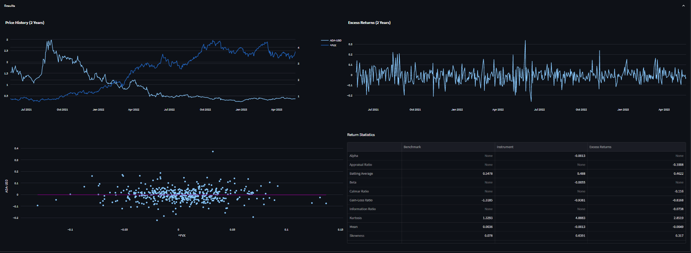

# Analysis of Financial Instruments

Analyze financial instruments' past performances with a just few clicks.

Contact me: [LinkedIn](https://www.linkedin.com/in/muratkoptur/) [GitHub](https://github.com/mrtkp9993) [Email](mailto:contact@muratkoptur.com)

Support me: [GitHub Sponsor](https://github.com/sponsors/mrtkp9993) [Patreon](https://www.patreon.com/muratkoptur)

Made with ❤️ by [Murat Koptur](https://muratkoptur.com)

---

Check my Android apps

[tradeslyFX Forex AI Roboadvisor](https://play.google.com/store/apps/details?id=com.tradesly.tradeslyfx)

[tradeslyPro Cryptocurrency AI Roboadvisor](https://play.google.com/store/apps/details?id=com.tradesly.tradeslypro)

---

